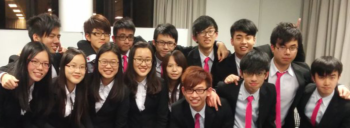

We are RAZZLE, the 18th Cabinet of the People’s Campus Radio, HKUSTSU, Session 2014-2015. Our name Razzle carries the meaning of enjoyment and therefore we aim at bringing entertainment to our members and audiences. Since 1997, online radio broadcasting was introduced to People’s Campus Radio. And therefore in this year, we will try our best to provide high quality programmes. As an ICA and media in HKUST, we aim at providing meaningful functions to our members and HKUST students. At the same time, we consider PCR members as our families and we want our members to feel the warmth of People’s Campus Radio. Our cabinet consists of 15 compositions, including the President, the Internal and the External Vice-Presidents, the Financial Secretary, the Internal and External Secretaries and some other technicians. To conclude, nothing will be more delightful than working as a DJ in People’s Campus Radio. In the following days, Razzle will face all challenges and adversity bravely, by receiving your support and holding your hands.
Our cabinet consists of 12 compositions, including the President, the Internal and the External Vice-Presidents, the Financial Secretary, the Internal and External Secretaries and some other technicians.

### The 18th Cabinet of People's Campus Radio, HKUSTSU (2014-2015)

- President - WONG Tsz King (Patrick)
- Internal Vice President - KAN Hoi Yin (DK)
- External Vice President - CHAN Sin Lok (Jason)
- Financial Secretary - LAM Ka Yin (Alex)
- Internal Secretary - LI Yu Kan (Ken)
- External Secretary - YUEN Hin Hei (Hayden)
- Marketing Officer - CHU Yat Min (Hannibal)
- Promotion Director - SZE Mik Ying (Joy)
- Programme Director - CHO Sin Ha (Cindy)
- Programme Director - MA Jie (Em)
- Programme Director - TSE Tsz Kwan (Tissue)
- Production Director - CHOI Yuk Hei (Jeffrey)
- Production Director - NGAN Tak Chuen (Tommy)
- General Technical Officer - CHONG Sung Him (Anson)
- Team Manager - LAU Tsz Wai (Angel)
