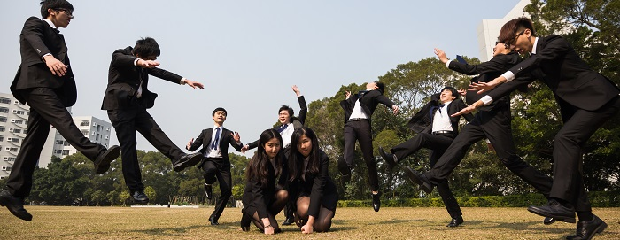

We are RADIANT, the 19th Cabinet of the People’s Campus Radio, HKUSTSU, Session 2015-2016. Our name RADIANT carries the meaning of passion that we have towards our work and the ambition we hold in the coming future. The core motive and expectation from our members is enjoying broadcasting and gaining sense of achievement from it. Besides, we understand that our members look forward diversity. So we aim to serve and satisfy our members, produce high quality programs and provide various activities. As an ICA, we hope to have more communication and cooperation with other societies and facilitate the dynamism in HKUST. As the media in HKUST, we hope to perform as an amiable and interactive role like what our slogan “你今日聽咗未啊？“presents. We do hope it becomes a daily habit of the students in HKUST to listen to our radio program.

Our cabinet consists of 12 compositions, including the President, the Internal and the External Vice-Presidents, the Financial Secretary, the Internal and External Secretaries and some other technicians.

We look forward all members of PCR gathering and sticking together like a family and blaze!
### The 19th Cabinet of People's Campus Radio, HKUSTSU (2015-2016)

- President - POON Ka Wai (Vanessa)
- Internal Vice President - CHAN Lok Sang (John)
- External Vice President - CHAN Lit Cheung (Simon)
- Financial Secretary - LEE Wasin (Wasin)
- Internal Secretary - TANG Sze Chai (Anson)
- External Secretary - CHIU San Fung (Samuel)
- Marketing Officer - WOO Ka Ki (Tom)
- Promotion Director - TSUI Shek Cheung (Tom)
- Programme Director - LO Tsz Fung (Jasper)
- Production Director - WONG Chun Him (Him)
- General Technical Officer - WANG Anqi (Taylor)
- Team Manager - CHAN Sum Chau (Miro)
