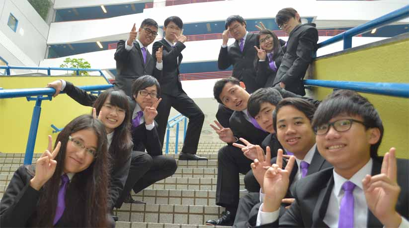

We are Skywalker, the 21st Elected Cabinet of People’s Campus Radio, HKUSTSU, Session 2017-18. Our name Skywalker carries the meaning of passion that we have towards our work and the ambition we hold in the coming future. The core motive and expectation from our members is enjoying broadcasting and gaining sense of achievement from it. Besides, we understand that our members look forward diversity. So we aim to serve and satisfy our members, produce high quality programs and provide various activities. As an ICA, we hope to have more communication and cooperation with other societies and facilitate the dynamism in HKUST. As the media in HKUST, we hope to perform as an amiable and interactive role. We do hope it becomes a daily habit of the students in HKUST to listen to our radio program.

### The 21st Cabinet of People's Campus Radio, H#KUSTSU (2019-2020)

- President - TSE Pik Ling (Betty)
- Internal Vice President - NG Tsz Hin (Peter)
- External Vice President - CHAN Tsz Hin (Lin)
- Financial Secretary - LAU Wing Ip (Sam)
- Internal Secretary - LAU Yat Ming (Alan)
- External Secretary - LAU Yat MIng (Alan)
- Marketing Officer - LAU Yat Ming (Alan)
- Promotion Director - WONG Wang Sing (Aidan)
- Programme Director - WONG Wang Sing (Aidan)
- Production Director - WONG Wang Sing (Aidan)
- General Technical Officer - LAU Yat Ming (Alan)
- Team Manager - WONG Wang Sing (Aidan)
