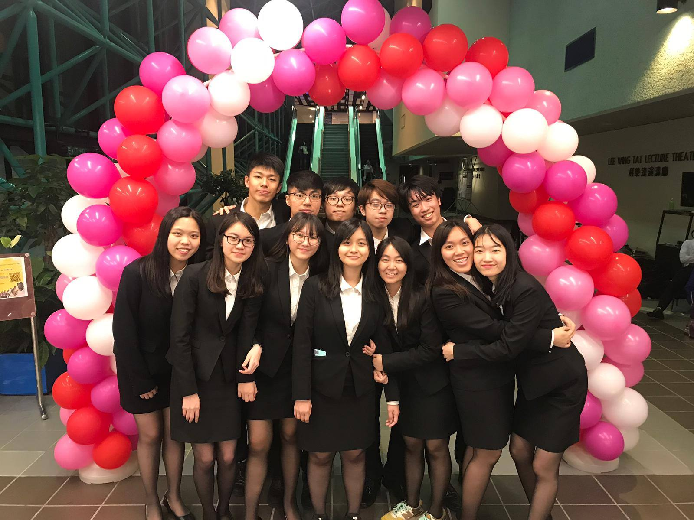

We are Rhapsody, the 23rd Cabinet of the People’s Campus Radio, HKUSTSU, Session 2019-2020.

Rhapsody starts with ‘R’, a typical and representative letter for our society – Radio. It is hoped that when people see Rhapsody, they can relate ‘R’ in the word to radio. Rhapsody also means ‘an effusively enthusiastic or ecstatic expression of feeling’. People’s Campus Radio vowed to provide high-quality broadcasting programme as well as a platform for HKUST students to express themselves. With the name Rhapsody, it is hoped that all Executive Committees Members, members of People’s Campus Radio, and every HKUST students, can be daring and willing to express their own opinions or thoughts on different topics and issues enthusiastically and ecstatically. When each of our voice of opinions and thoughts is combined, we can create a perfect rhapsody.

In addition, Rhapsody best describes our Executive Committee Members and the cabinet’s goal – innovative minds and unlimited creation. It is aimed that in the coming year, unlimited brand new and fresh ideas can be brainstormed and applied in functions or events of our society, thus making it a better place and further promoting it in HKUST.

The future goal of the elected cabinet, Rhapsody, is to develop and promote People’s Campus Radio in a more diversified way. Besides focusing solely on broadcasting, making interesting short videos will be another main focus as well. By creating and uploading videos of funny topics as well as hot issues on People’s Campus Radio’s YouTube channel, we can enhance our bonding with the members of our society, and further promote our society in the campus.

We wish that through the endeavor and contribution of all Executive Committee Members, the proposed activities can be held successfully and smoothly. Most importantly, it is hoped that People’s Campus Radio can be greatly promoted inside HKUST, and ideally, beyond HKUST in the coming year.

### The 23rd Cabinet of People's Campus Radio, HKUSTSU (2019-2020)

- President - NG, Yee Ki (Coco)
- Internal Vice President - MAK, Wai Kit (Sam)
- External Vice President - CHAN, Chin Ngai (Sunny)
- Financial Secretary - WONG, Hoi Ching (Echo)
- Internal Secretary - YEUNG, Ka Hei (Yvonne)
- External Secretary - LAM, Wan Ki (Winky)
- Marketing Officer - YEUNG, Ka Hei (Yvonne)
- Promotion Director - YUNG, Long Ting (Viann)
- Promotion Director - YU, Pik Ching (Gigi)
- Programme Director - LEUNG, Yat Man (Alex)
- Production Director - LI, Siu Long (Long)
- Production Director - WONG, Ho Lam (Vicko)
- General Technical Officer - LI, Siu Long (Long)
- Team Manager - LEE, Hoi Yan (Isabella)
